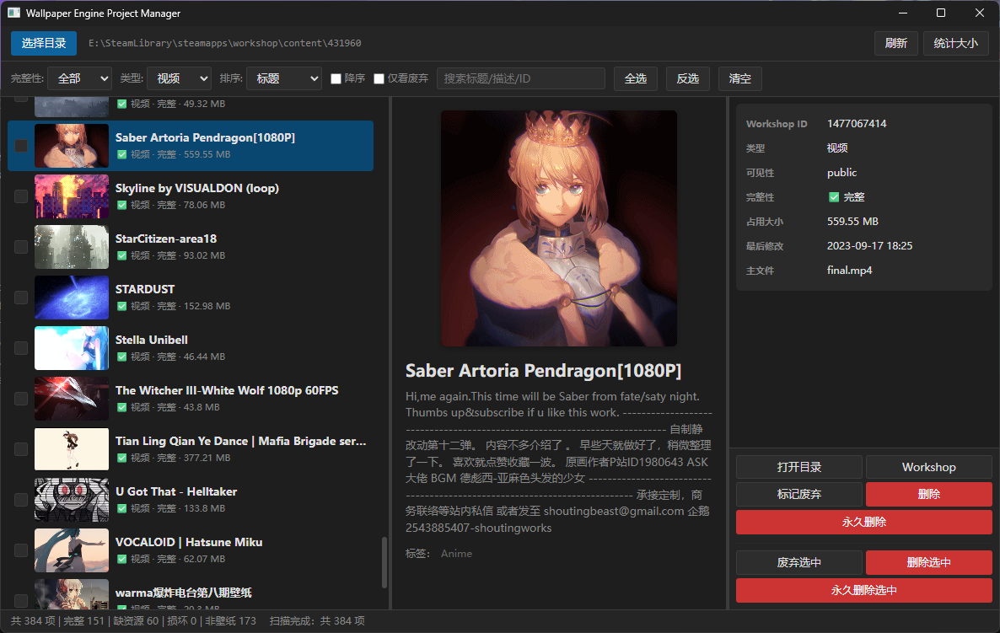

# Wallpaper Engine Project Manager

<p align="center">
  
</p>

一个用来整理 Wallpaper Engine 本地壁纸目录内容的小工具  
主要用来检索并管理因为各种各样原因导致遗留在本地的看不到的壁纸与相关文件

> ⚠️ 这是用来学习和探索各种工具和开发流程的探索项目，不打算频繁维护，也不保证稳定性。

## 主要功能

- 扫描 Workshop 目录，解析每个 `project.json`
- 识别并展示壁纸信息
- 按需统计大小（可取消）
- 资源管理器定位、跳转 Steam 工坊页面
- 删除（送回收站/永久删除）、标记废弃

## 使用

1. 自行 `dotnet publish`
2. 点击 **选择目录**，定位到你本地壁纸目录

## 技术栈

- .NET 8（`net8.0-windows`）
- [Photino.NET](https://github.com/tryphotino/photino.NET) — 轻量原生 WebView 桌面框架
- 前端：原生 HTML / CSS / JS，无前端框架

选 Photino 是想试一下使用C#和WebView前端快速开发工具应用

## 构建

```bash
dotnet publish -c Release -r win-x64
```

## 说明

- 仅 Windows x64
- 删除操作请谨慎，永久删除不可撤销
- Wallpaper Engine 与 Steam 为各自所有者的商标，本项目与之无关联
